# 🏆 Complete Tutorial Index & Master Roadmap

_Your comprehensive guide to mastering every aspect of modern React development_

---

## 🎯 Complete Tutorial Series Status

**✅ COMPLETE TUTORIALS:**

### **🏗️ Foundation & Setup** (01-02)

- **[01. Repository Setup & Architecture](./01-repository-setup.md)** ✅
  - Project structure mastery
  - Development environment optimization
  - Dependency management with Yarn

- **[02. Development Workflow Excellence](./02-development-workflow.md)** ✅
  - Quality-first development processes
  - Git workflows and automation
  - CI/CD pipeline integration

### **⚡ Component Architecture** (03-04)

- **[03. CVA Patterns & Variant Systems](./03-cva-patterns.md)** ✅
  - Class-Variance-Authority mastery
  - Scalable component design
  - Performance-optimized variants

- **[04. TypeScript Patterns & Advanced Usage](./04-typescript-patterns.md)** ✅
  - Generic component patterns
  - Type-safe APIs and forms
  - Advanced TypeScript utilities

### **🛡️ Quality & Standards** (05-07)

- **[05. Accessibility Patterns & Excellence](./05-accessibility-patterns.md)** ✅
  - WCAG 2.1 AA compliance
  - Screen reader optimization
  - Inclusive design patterns

- **[06. Testing Strategy & Comprehensive Quality](./06-testing-strategy.md)** ✅
  - Vitest and React Testing Library
  - Accessibility testing automation
  - Quality metrics and reporting

- **[07. Performance Optimization & Monitoring](./07-performance-optimization.md)** ✅
  - Bundle optimization techniques
  - Core Web Vitals mastery
  - Real-time performance monitoring

### **📚 Documentation Excellence** (08)

- **[08. Storybook Documentation & Visual Testing](./08-storybook-documentation.md)** ✅
  - Interactive component documentation
  - Visual testing strategies
  - Advanced Storybook patterns

---

## 🚀 Integrated Learning Paths

### **🎯 Full-Stack Mastery Path** (Recommended)

**Complete developer transformation - 8 weeks**

```mermaid
graph TD
    A[01. Repository Setup] --> B[02. Development Workflow]
    B --> C[03. CVA Patterns]
    C --> D[04. TypeScript Patterns]
    D --> E[05. Accessibility]
    E --> F[06. Testing Strategy]
    F --> G[07. Performance Optimization]
    G --> H[08. Storybook Documentation]
    H --> I[🏆 Master Developer]
```



**Week-by-Week Breakdown:**

- **Week 1:** Foundation (01-02) - Architecture & workflow mastery
- **Week 2:** Component Architecture (03-04) - CVA & TypeScript patterns
- **Week 3:** Quality Foundation (05-06) - Accessibility & testing
- **Week 4:** Performance & Documentation (07-08) - Optimization & Storybook

### **⚡ Frontend Specialist Path**

**Component library expert - 4 weeks**

`01 → 02 → 03 → 04 → 08`

Focus: Component architecture, TypeScript mastery, documentation excellence

### **♿ Accessibility Champion Path**

**Inclusive design expert - 4 weeks**

`01 → 02 → 05 → 06 → 08`

Focus: WCAG compliance, testing automation, accessible documentation

### **🧪 Quality Engineer Path**

**Testing and performance expert - 4 weeks**

`01 → 02 → 06 → 07 → 08`

Focus: Comprehensive testing, performance monitoring, quality systems

---

## 📊 Skill Progression Matrix

| Tutorial                 | React    | TypeScript | Testing    | A11y       | Performance | Architecture |
| ------------------------ | -------- | ---------- | ---------- | ---------- | ----------- | ------------ |
| 01. Repository Setup     | ⭐⭐     | ⭐⭐       | ⭐         | ⭐         | ⭐          | ⭐⭐⭐⭐     |
| 02. Development Workflow | ⭐⭐⭐   | ⭐⭐       | ⭐⭐⭐     | ⭐⭐       | ⭐⭐        | ⭐⭐⭐⭐     |
| 03. CVA Patterns         | ⭐⭐⭐⭐ | ⭐⭐⭐     | ⭐⭐       | ⭐⭐       | ⭐⭐⭐      | ⭐⭐⭐       |
| 04. TypeScript Patterns  | ⭐⭐⭐⭐ | ⭐⭐⭐⭐⭐ | ⭐⭐⭐     | ⭐⭐⭐     | ⭐⭐⭐      | ⭐⭐⭐⭐     |
| 05. Accessibility        | ⭐⭐⭐   | ⭐⭐⭐     | ⭐⭐⭐     | ⭐⭐⭐⭐⭐ | ⭐⭐        | ⭐⭐⭐       |
| 06. Testing Strategy     | ⭐⭐⭐   | ⭐⭐⭐     | ⭐⭐⭐⭐⭐ | ⭐⭐⭐⭐   | ⭐⭐⭐      | ⭐⭐⭐       |
| 07. Performance          | ⭐⭐⭐   | ⭐⭐       | ⭐⭐       | ⭐⭐       | ⭐⭐⭐⭐⭐  | ⭐⭐⭐⭐     |
| 08. Storybook Docs       | ⭐⭐⭐   | ⭐⭐⭐     | ⭐⭐⭐     | ⭐⭐⭐     | ⭐⭐        | ⭐⭐⭐⭐     |

---

## 🎓 Certification Levels & Career Outcomes

### **🥉 Foundation Certified** (Tutorials 1-2)

**Prerequisites met for:**

- Junior React Developer positions
- Component library contributor roles
- Bootcamp graduation readiness

**Skills Unlocked:**

- Modern React development setup
- Quality-first development workflows
- Git collaboration mastery

### **🥈 Intermediate Certified** (Tutorials 1-4)

**Prerequisites met for:**

- Mid-level Frontend Developer positions
- Component library maintainer roles
- Technical mentoring opportunities

**Skills Unlocked:**

- Advanced component architecture
- TypeScript expertise
- Scalable design systems
- Enterprise-grade development patterns

### **🥇 Advanced Certified** (Tutorials 1-6)

**Prerequisites met for:**

- Senior Frontend Developer positions
- Accessibility consultant roles
- Technical lead opportunities
- Open source project maintenance

**Skills Unlocked:**

- WCAG 2.1 AA compliance expertise
- Comprehensive testing strategies
- Quality assurance system design
- Inclusive development practices

### **💎 Master Certified** (All Tutorials 1-8 Complete)

**Prerequisites met for:**

- Principal/Staff Engineer positions
- Frontend Architect roles
- Technical consulting opportunities
- Conference speaking engagements
- Open source project leadership

**Skills Unlocked:**

- Complete development stack mastery
- Performance optimization expertise
- Documentation excellence
- Team leadership capabilities
- Enterprise architecture design

---

## 🛠️ Integration Project Ideas

Apply your learning with these progressive projects:

### **Project 1: Personal Component Library**

**After completing 01-04**

- Build 5-10 reusable components with CVA variants
- Implement full TypeScript typing system
- Set up development workflow and architecture

### **Project 2: Accessible Form System**

**After completing 05-06**

- Create comprehensive accessible form components
- Implement full WCAG 2.1 AA compliance
- Build automated testing suite with a11y validation

### **Project 3: Enterprise Dashboard**

**After completing 07-08**

- Build production-ready performant dashboard
- Implement comprehensive monitoring and optimization
- Create complete Storybook documentation system

### **Project 4: Open Source Contribution**

**Master level**

- Contribute to major React library
- Implement accessibility improvements
- Add comprehensive test coverage

---

## 📈 Beyond the Tutorials: Advanced Mastery

### **Emerging Technologies to Explore**

- **React Server Components** - Next.js App Router mastery
- **Micro Frontends** - Scalable application architecture
- **Web Components** - Cross-framework component sharing
- **WebAssembly** - Performance-critical computations
- **AI/ML Integration** - Intelligent user interfaces

### **Advanced Patterns to Master**

- **Compound Component Patterns** - Complex component composition
- **Render Props & Higher-Order Components** - Advanced reusability
- **Custom Hooks Architecture** - Reusable logic patterns
- **State Machine Design** - Predictable state management
- **Micro-interaction Design** - Delightful user experiences

### **Professional Development**

- **Technical Writing** - Blog posts, documentation, tutorials
- **Open Source Leadership** - Maintain popular repositories
- **Conference Speaking** - Share knowledge at events
- **Team Mentoring** - Guide junior developers
- **Architecture Consulting** - Help companies scale

---

## 🚀 Your Next Steps

### **Phase 1: Foundation** (Weeks 1-2)

```bash
# Set up your learning environment
git clone https://github.com/LesTasker2023/Daedalus.git
cd Daedalus
yarn install

# Complete foundation tutorials
- [ ] Read 01. Repository Setup
- [ ] Follow 02. Development Workflow
- [ ] Build your first component using the patterns
```

### **Phase 2: Specialization** (Weeks 3-6)

Choose your path and dive deep:

- **Component Architecture:** Focus on 05, 10
- **Quality & Accessibility:** Focus on 07, 08
- **Performance & Documentation:** Focus on 06, 09

### **Phase 3: Integration** (Weeks 7-8)

Complete all remaining tutorials and build integration projects

### **Phase 4: Mastery** (Ongoing)

- Contribute to open source projects
- Share knowledge through writing/speaking
- Mentor other developers
- Stay current with ecosystem changes

---

## 🤝 Community & Support

### **Learning Resources**

- **📚 Documentation:** Each tutorial includes comprehensive examples
- **💻 Code Examples:** All patterns implemented in the codebase
- **🧪 Tests:** Learn from our comprehensive test suite
- **📖 Storybook:** Interactive component documentation

### **Getting Help**

- **GitHub Issues:** Technical questions and bug reports
- **GitHub Discussions:** Community Q&A and sharing
- **Discord Community:** Real-time help and networking _(Coming Soon)_
- **Weekly Office Hours:** Direct access to maintainers _(Coming Soon)_

### **Contributing Back**

- **Documentation Improvements:** Help make tutorials clearer
- **Code Examples:** Add more real-world examples
- **Translation:** Help translate tutorials to other languages
- **New Tutorials:** Propose additional advanced topics

---

## 📊 Tutorial Statistics & Impact

### **Current Impact**

- **8 Complete Tutorials** in logical progression (01-08)
- **4 Learning Phases:** Foundation → Architecture → Quality → Documentation
- **10+ Hours** of comprehensive structured content
- **50+ Code Examples** with real-world applications
- **100+ Best Practices** documented and explained
- **Professional-Grade** patterns ready for enterprise use

### **Community Growth**

- **Skill Advancement:** Junior → Senior developer transformation
- **Career Impact:** Portfolio enhancement and interview preparation
- **Industry Standards:** Following modern React ecosystem best practices
- **Open Source:** Contribution-ready knowledge and skills

---

## 💫 Final Thoughts: Your Journey to Mastery

You now have access to a **complete, enterprise-grade development education**. This isn't just about learning React—it's about **transforming into a developer who builds systems that scale**.

### **What Makes This Different:**

- **🏢 Enterprise-Proven:** Patterns used in production applications
- **🌍 Accessibility-First:** Inclusive design from the ground up
- **🧪 Quality-Driven:** Comprehensive testing and quality assurance
- **⚡ Performance-Focused:** Optimized for real-world scale
- **📚 Documentation-Complete:** Professional-grade documentation

### **Your Commitment:**

- **📅 Dedicate consistent time:** 3-5 hours per week minimum
- **💻 Code along actively:** Don't just read, implement
- **🤝 Engage with community:** Share progress and ask questions
- **🎯 Apply to real projects:** Use learnings in practical applications
- **🔄 Review and iterate:** Revisit tutorials as you grow

### **The End Goal:**

By completing this tutorial series, you'll have the **confidence, knowledge, and skills** to:

- **Build production-ready component libraries**
- **Lead frontend architecture decisions**
- **Mentor junior developers effectively**
- **Contribute to major open source projects**
- **Drive accessibility and quality initiatives**
- **Optimize applications for enterprise scale**

---

**Ready to begin your transformation?**

**[🚀 Start with Repository Setup](./01-repository-setup.md)** and take the first step toward React mastery.

_Your future self will thank you for starting today._ ✨

---

_Built with ❤️ by developers who believe in continuous learning and knowledge sharing. Join us on this journey to excellence._
